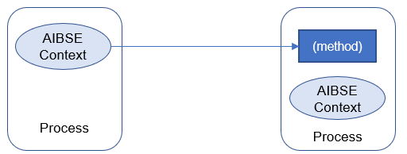
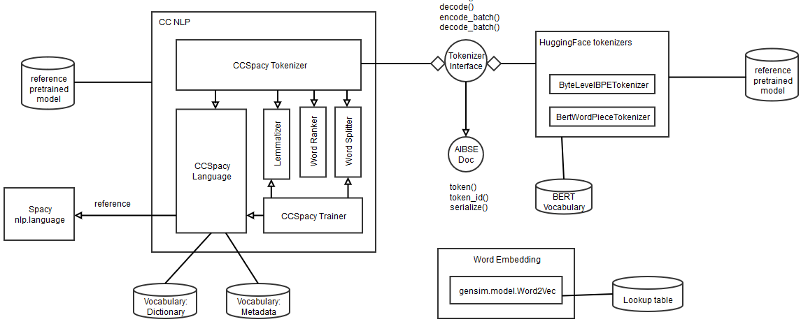

# AIBSE Architecture

## Main Concepts

(For high-level concepts about the AIBSE artefacts, see <a
href="https://inside-docupedia.bosch.com/confluence/display/TOP98/%282.5%29+Building+Block+View"
target="_blank"> Docupedia documentation </a>).

### AIBSE Context

AIBSE Context stores the global contextual information of the process running the AIBSE application. The most important
information is the configuration, which can be access via ``.config`` property. This allows the different process (for
example, client and a backend service) to exchange the information.

The following picture illustrates the usage of ABSE Context. Each process only consists of a single instance of AIBSE
Context (accessible via ``aibse.aibse_ctx``), and a method of a process (for example, backend server) can accept the
AIBSE Context object from other process (for example, client running ``aibse-cli``) to gather information from it.

The AIBSE context is accessed via variable `aibse_ctx`:

    from aibse import aibse_ctx
    aibse_ctx.config['VARIABLE_NAME']

The configuration can also be set by user at the runtime. Please see [API]() for more details.

### AIBSE Data

The ``aibse.data`` package consists of common ETL process for some popular data sources of requirements, such as DOORS
Classic CSV Export, as well as data handling within a training pipeline (for example, feature engineering)

> **_NOTE:_**  In ``aibse.v1``, the Data package of AIBSE only consists of ETL process and not the preprocessing of the
> training pipeline (a.k.a feature engineering)

The current structure of ``aibse.data`` is described below. Note that the modules marked with (**) deems not relevant to
data package, or need a major refactoring in v1. For example: code ported from v0.2 (aibse-prod) for
backward-compatibility, etc.

Modules and packages        | Purpose                     | Description
--------------------------- |-----------------------------| -------
``context``                 | AIBSE context               | General helper functions to reason about runtime environment of an AIBSE application
``data``                    | Data handling for training  | Different methods and classes to transform data for training in main-stream use cases (currently Attributes Assignment and Requirements Linking)
``data.doors.csv``          | ETL process                 | data processing code for handling DOORS Classic export (test with CC-AS, PS, and CC/ESB3 data)
``nlp``                     | Natural Language Processing | AIBSE NLP toolkit (CCSpacy for tokenization, Metalib and BPEmb for embedding)
``link``                    | Linking Recommendation      | Use (near)-duplicated data to recommend internal requirements to be linked for each new project
``io``                      | I/O abstraction             | Main implementation of cleaning logic for raw DOORS CSV data
``train``                   | Training pipeline           | Abstraction of AIBSE training pipeline and helper
``log``                     | Logging artifacts           | Write models and metrics during the training to mlflow tracking server and run store
``ndd``                     | Near-duplicates Detection   | Implementation of different NDD algorithms
``metric``                  | Evaluation script           | Evaluation of AIBSE AI methods in different use cases
``deployment``              | Model serving               | Different MLFlow (Python model) classes to use the prediciton model within a serving backend
``helper``                  | Utility                     | Several small helper functions that are not fit anywhere

#### ETL for DOORS CSV Export

(For the high-level description of the data handling of DOORS CSV, see <a
href="https://inside-docupedia.bosch.com/confluence/display/TOP98/DOORS+Data+Preprocessing"
target="_blank"> Docupedia documentation </a>).

The logic of cleaning and transforming is implemented in ``aibse.data.doors.csv``. Here the main entry point is the
method
``run_prepro()``, which accepts a root directory where the source CSV is stored and when the output (.parquet files) are
returned.

### AIBSE NLP

(to be updated)
AIBSE NLP currently provides two kinds of algorithms:

- Heuristics-based tokenization and word-level vocabulary building (CCSpacy)
- Sub-word level tokenization and embedding (BPEmb, Meta Embedding)

The (old) documentation for ``aibse.nlp`` can be found in the <a
href="https://inside-docupedia.bosch.com/confluence/pages/viewpage.action?pageId=1410861086"
target="_blank"> PoC Docupedia, </a>).

For the reference to Meta Embedding, please check the publications: https://aclanthology.org/2021.emnlp-main.660/ and
<a href="https://github.boschdevcloud.com/bios-bcai/meta-embeddings">Original Library Repository</a>

